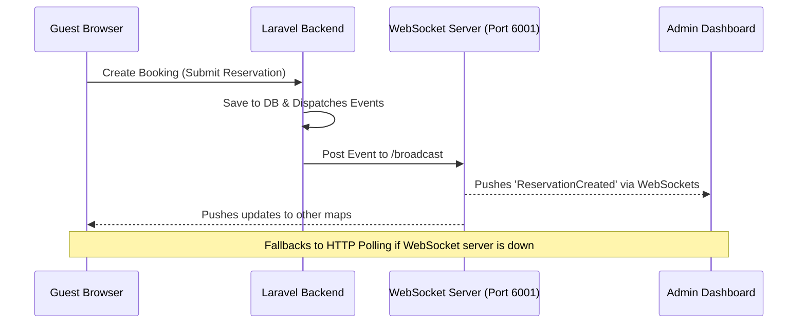

# Bellevue Manila - Seat & Table Management System

A real-time venue reservation, interactive seat-mapping, and layout customization system designed for premium hospitality services. This system enables guests to select specific tables or seats, allows admins to visually design seat layouts using drag-and-drop tools, and keeps data synchronized in real-time.

---

## 🏗️ System Architecture

The project consists of three main components:
1. **Frontend:** React 19 + Vite client application.
2. **Backend:** Laravel 12 API with an SQLite database.
3. **WebSocket Helper:** A lightweight Node.js event broadcast server.



---

## 🛠️ Technology Stack

### Frontend
- **Framework:** React 19 (compiled with Vite 7)
- **Routing & State:** React Router Dom v7, React Hooks
- **Layout Designer:** Custom interactive canvas built with `@dnd-kit/core` and `@dnd-kit/sortable`
- **Animations:** GSAP & Framer Motion for premium, smooth micro-interactions
- **Styling:** Custom Vanilla CSS for absolute control, with Tailwind CSS integrations
- **Data Visualizations:** Recharts for analytics dashboards

### Backend
- **Framework:** Laravel 12.x (running on PHP 8.2+)
- **Database:** SQLite (local development database)
- **Authentication:** Laravel Sanctum (token-based api authentication)
- **Queue System:** Laravel queue listener for async reminders and notifications
- **Broadcasting:** Laravel Event Broadcasting with Pusher server integrations

### Real-Time WebSocket Server
- **Server:** Custom Node.js HTTP/WebSocket server (`ws` package) running on port `6001`
- **Sync Model:** Periodically polls the Laravel `/broadcasts` endpoint or forwards incoming `/broadcast` POST payloads to all active clients

### Local Dev Tools
- **Mail sandbox:** MailHog / Mailpit (port `8025` UI / port `1025` SMTP) for tracking transactional reservation emails

---

## ⚙️ Project Structure

```
seat-table-mngmnt/
├── backend/                  # Laravel 12 API Backend
│   ├── app/                  # Controllers, Services, Models, and Jobs
│   ├── database/             # SQLite migrations, seeders, and factories
│   └── routes/               # API endpoints
├── frontend/                 # React 19 Client Frontend
│   ├── src/                  # React components, routing, and assets
│   └── public/               # Static assets
└── tools/
    └── websocket/            # Custom WebSocket server implementation
```

---

## 🚀 Getting Started

### 📋 Prerequisites
- **PHP** >= 8.2
- **Composer** (PHP dependency manager)
- **Node.js** >= 18 (with `npm`)

---

### 1. Backend Setup (Laravel)

1. Navigate to the backend directory:
   ```bash
   cd backend
   ```

2. Install PHP dependencies:
   ```bash
   composer install
   ```

3. Create the environment file:
   ```bash
   copy .env.example .env
   ```

4. Generate the application encryption key:
   ```bash
   php artisan key:generate
   ```

5. Run migrations and seed the database (includes roles, permissions, and initial venue mappings):
   ```bash
   php artisan migrate --seed
   ```

6. Boot the development servers (runs the API server, queue listener, logs, and hot-reloaders concurrently):
   ```bash
   composer dev
   ```
   *The API will run on `http://localhost:8000`.*

---

### 2. Frontend Setup (React)

1. Navigate to the frontend directory:
   ```bash
   cd frontend
   ```

2. Install Node dependencies:
   ```bash
   npm install
   ```

3. Run the Vite development server:
   ```bash
   npm run dev
   ```
   *The application UI will run on `http://localhost:5173`.*

---

### 3. WebSocket Helper Setup (Real-Time Sync)

To keep seating maps and admin dashboards synchronized instantly without waiting for poll intervals, run the WebSocket server:

1. From the project **root** directory, install standard dependencies:
   ```bash
   npm install
   ```

2. Run the WebSocket server:
   ```bash
   npm run websocket
   ```
   *The WebSocket server will start on `ws://localhost:6001`.*

> [!NOTE]
> **Resiliency & Fallback Polling:** If the WebSocket server is not running (e.g., during light local development), the frontend automatically falls back to HTTP Polling. 
> The interactive customer map polls the backend every **10 seconds**, and the admin dashboards poll every **5 seconds**. 

---

### 4. Transactional Mail Testing (MailHog / Mailpit)

Reservation confirmations and reminders are dispatched via email. You can capture and read these locally:

- **Windows:** Run `MailHog.exe` located in the root directory.
- Open your browser and navigate to `http://localhost:8025` to view the local mail inbox.
- Ensure your backend `.env` matches the local SMTP configuration:
  ```env
  MAIL_MAILER=smtp
  MAIL_HOST=127.0.0.1
  MAIL_PORT=1025
  ```
